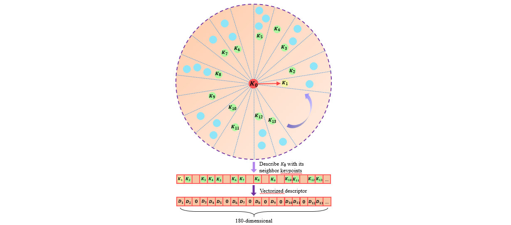

LinK3D is develped for the real-time 3D feature extraction and matching of LiDAR point cloud, which generates accurate point-to-point matching results in real time. The core idea of LinK3D is derived from a very simple principle: representing the current keypoint with its neighboring keypoints.

