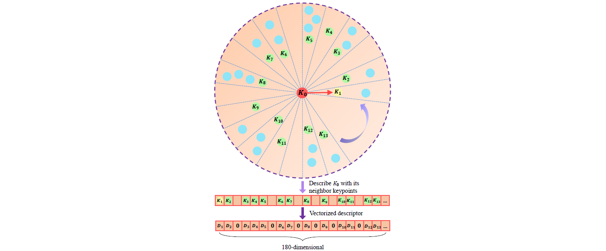

LinK3D is develped for the real-time 3D feature extraction and matching of LiDAR point cloud, which generates accurate point-to-point matching results in real time. The LinK3D paper **"LinK3D: Linear Keypoints Representation for 3D LiDAR Point Cloud"** (**[PDF](https://arxiv.org/pdf/2206.05927.pdf)**) has been accepted by IEEE Robotics and Automation Letters (RA-L). The core idea of LinK3D is derived from a very simple principle: representing the current keypoint with its neighboring keypoints. The LinK3D descriptor is represented by a 180-dimensional vector. It can be potentially extended to 3D registration and LiDAR odometry. We also proposed the real-time place recognition algorithm BoW3D based on LinK3D. For more details about BoW3D, please refer to our paper **"BoW3D: Bag of Words for Real-Time Loop Closing in 3D LiDAR SLAM"** in IEEE Robotics and Automation Letters (RA-L) (**[PDF](https://arxiv.org/pdf/2208.07473.pdf)**).

## 1. Publication
If you use the code in an academic work, please cite:

    @ARTICLE{9944848,
      author={Cui, Yunge and Chen, Xieyuanli and Zhang, Yinlong and Dong, Jiahua and Wu, Qingxiao and Zhu, Feng},
      journal={IEEE Robotics and Automation Letters}, 
      title={BoW3D: Bag of Words for Real-Time Loop Closing in 3D LiDAR SLAM}, 
      year={2023},
      volume={8},
      number={5},
      pages={2828-2835},
      doi={10.1109/LRA.2022.3221336}}
